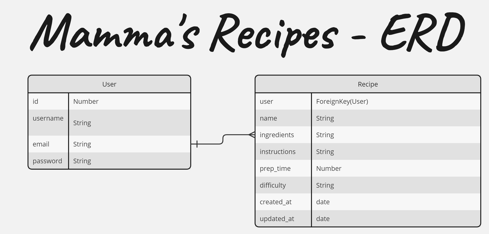
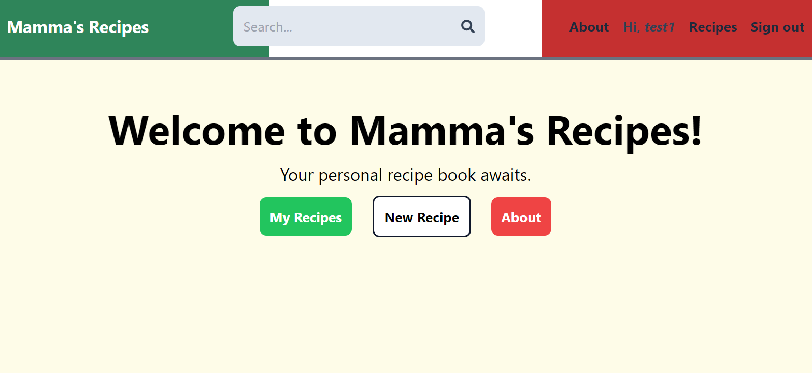
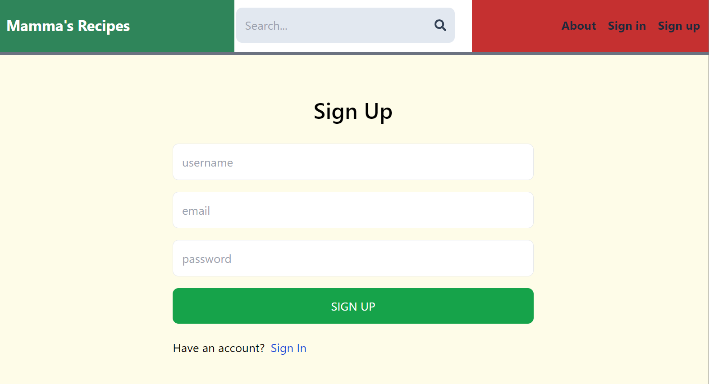
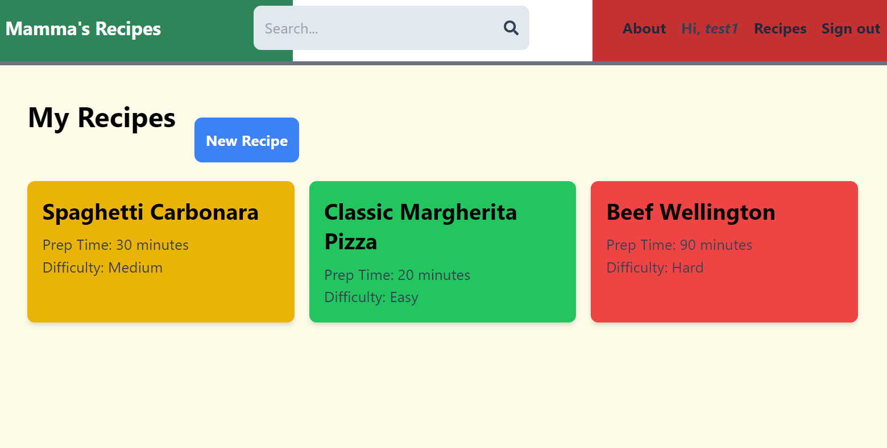
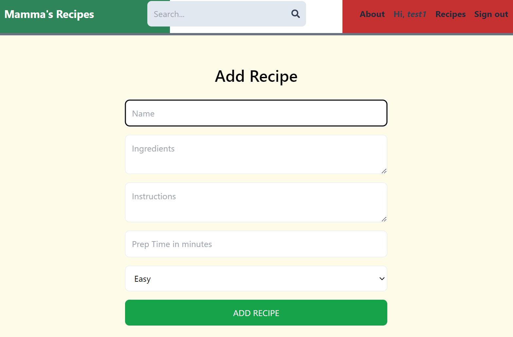
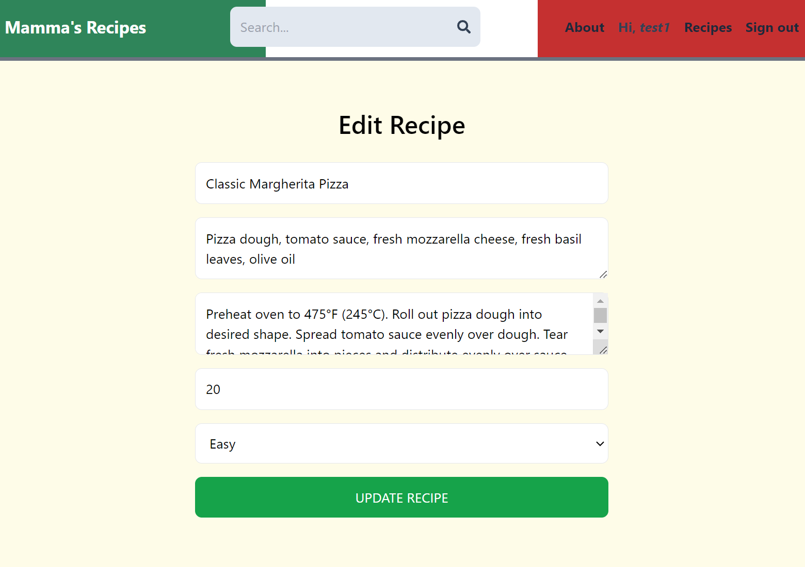
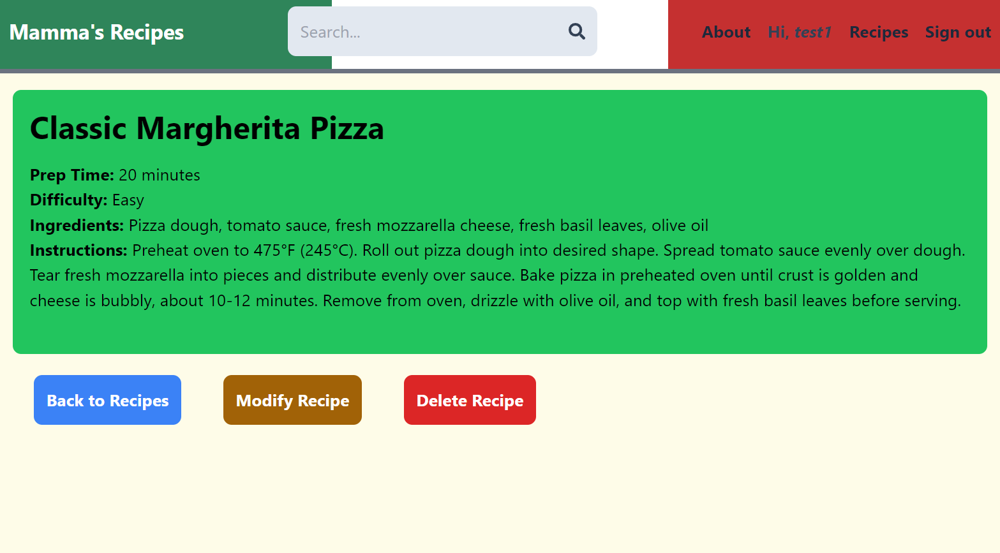

# Mamma's Recipes

## Overview
Mamma's Recipes is your personal recipe book  _Italian-Cuisine-fueled_ full-stack application allows users to create, manage, and browse their favorite recipes in a simple and user-friendly interface.

## Technologies used
- [Django](https://www.djangoproject.com/) for backend, including REST API developmetn
- [React](https://react.dev) for frontend
- [AWS](https://aws.amazon.com/) S3 for frontend deploying 
- [AWS](https://aws.amazon.com/) EC2 for backend deploying
- [Postman](https://www.postman.com/) for API testing and development
- [TailwindCSS](https://tailwindcss.com/) for fontend styling

## Objectives
- [x] Made the backend functional with all the CRUD operations correctly working
- [x] Implemented authentication and user managment
- [x] Made basic frontend
- [x] Implemented api functionalities in frontend
- [x] Enhanced UI/UX
- [x] Reached Minimum Viable Product (MVP)
- [ ] Deploy the backend publicly online
- [ ] Deploy the frontend publicly online
- [ ] Allowed users to search for recipes
- [ ] Improve auth

## User Stories
- As a user, I would like to create new recipes.
- As a user, I would like to browse all my recipes.
- As a user, I would like to view details of a single recipe, including ingredients and instructions.
- As a user, I would like to edit and delete my recipes.
- As a user, I would like to search for recipes using ingredients.
- As a user, I can authenticate and manage my recipes securely.

## Routes Table

### Recipes

| **URL** | **HTTP Verb** | **Action** |
|------|---------------|---------|
| /recipes/ | GET | index   |
| /recipes/:recipeId/ |  GET | show   |
| /recipes/ |  POST |  create |
| /recipes/:recipeId/ | PUT  |  edit |
| /recipes/:recipeId/ | DELETE  |  destroy |

### User
| **URL**          | **HTTP Verb**|**Action**|
|------------------|--------------|----------|
| /auth/signup    | POST         | create  
| /auth/login     | POST         | create       
| /auth/logout    | DELETE       | destroy  

## Entity Relationship Diagram
 
<!-- _Note: The ERD will be completed as the project progresses._ -->

## Wireframe
### Home
 

### Sign Up
 
### Recipes
 
### Create a Recipe
 
### Edit a Recipe
 

### Display a Recipe
 
<!--  -->
<!-- _Note: The wireframe will be completed as the project progresses._ -->

## Installation and Setup
### Backend Setup
- Open the terminal
- Clone the Repository:
> git clone https://github.com/alex/mammas-recipes.git

> cd mammas-recipes

- Set Up a Virtual Environment:
> python3 -m venv venv

> source venv/bin/activate

- Install Dependencies:
> cd MammasRecipesAPI

> pip install -r requirements.txt

- Run Migrations:

> python manage.py makemigrations

> python manage.py migrate

- Create a Superuser:

> python manage.py createsuperuser

- Start the Server:

> python manage.py runserver

### Frontend Setup
- Navigate to the Frontend Directory:

> cd mammas-recipes-client

- Install Dependencies:

> npm install

- Start the Development Server:

> npm start

### Running the App Locally
- Start the Backend Server:

> cd mammas-recipes

> source venv/bin/activate

> python manage.py runserver
- Start the Frontend Server:

> cd mammas-recipes-client

> npm start

Access the Application:
Open your web browser and navigate to http://localhost:3000 to access the frontend. The backend API will be accessible at http://localhost:8000/api.
